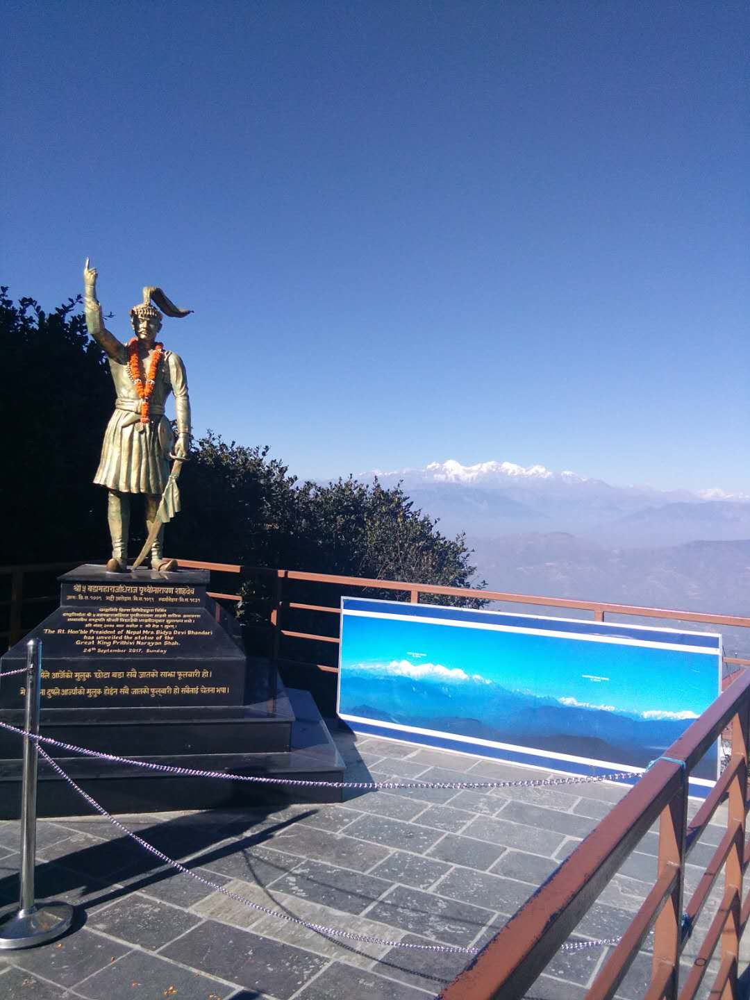
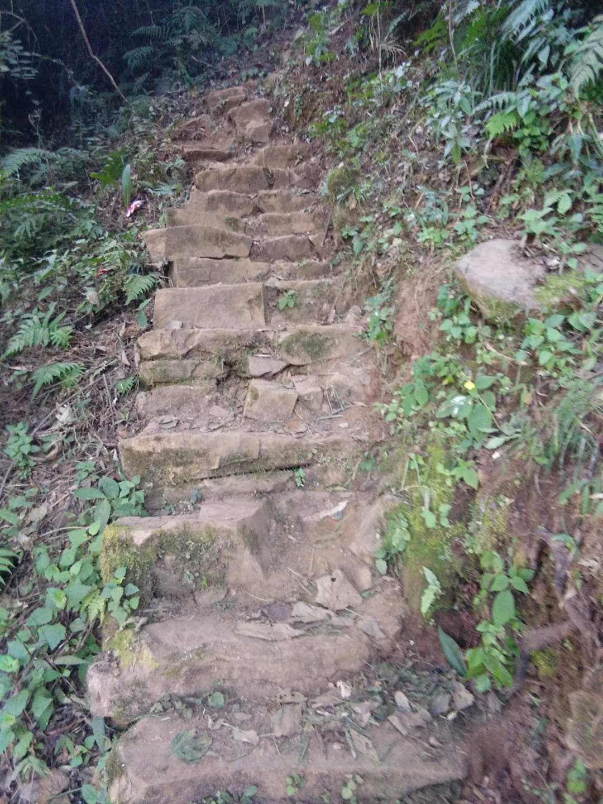
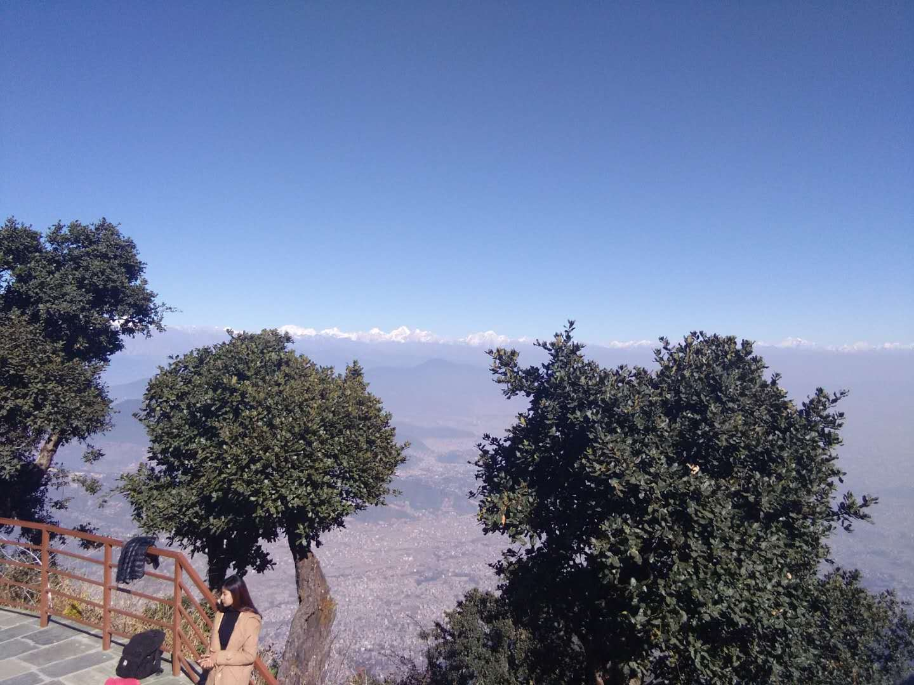
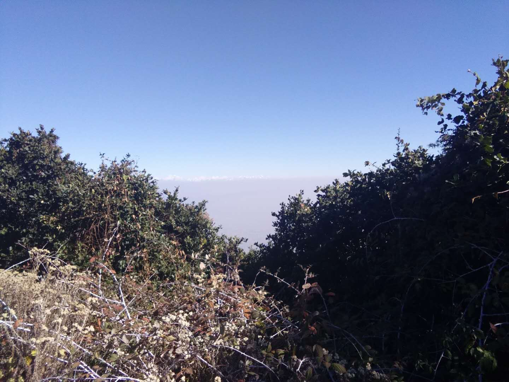

# [First Nepal Winter School in AI](https://nepalschool.naamii.com.np/home)

Prime College, Kathmandu, Nepal, 20-30,2018

## The Course will cover topics in the next ten days(20-30) include as follows:

### Day1.

- Linear algebra with computer vision

### Day2.

- Probability and statistics for machine learning

### Day3.

- Introduction to machine learning

### Day4.

- Optimization
- Image processing and computer vision

### Day5.

- Computational neuroscience
- AI and society

### Day6.

#### Hiking day

The aim mountain is [Chandragiri Hill](https://en.wikipedia.org/wiki/Chandragiri_Hill,_Nepal).
Share some wonderful pictures for this hicking experience in Nepal on 25.12, 2018.

### Day7.

- Deep learning basics

### Day8.

- Advanced deep learning

### Day9.

#### Deep learning applications

- Bioinformatics and Genomics
- Natural language processing(NLP)

### Day10.

- Internet of things(IoT)
- Reinforcement learning
- Deep face recognition(CV)

### Day11.

- Graphical Modeling
- Group presentation
- Panel discussion
- Closing ceremony
#

### Go back home and start to prepare everything for happen new year(2018-2019).
#
#

License
----

MIT

**Free Software, Hell Yeah!**

[//]: # (These are reference links used in the body of this note and get stripped out when the markdown processor does its job. There is no need to format nicely because it shouldn't be seen. Thanks SO - http://stackoverflow.com/questions/4823468/store-comments-in-markdown-syntax)
